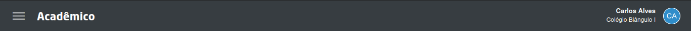
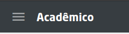
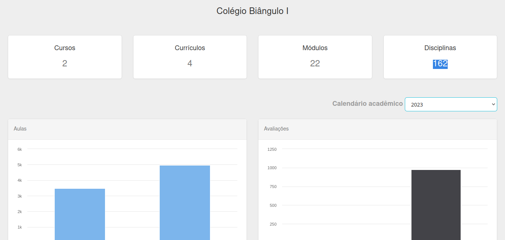
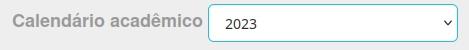
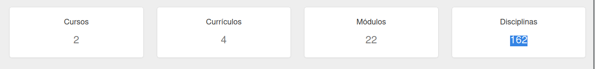
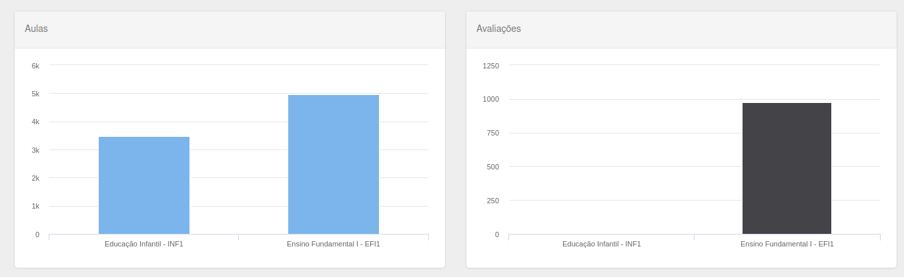

# Acadêmico

Esta seção é dedicada a descrever o módulo acadêmico, detalhando suas diversas partes e funcionalidades.

Este arquivo apresenta uma visão geral da tela inicial do módulo, enquanto os demais arquivos desta pasta explicam em detalhes cada uma das funcionalidades do módulo.

## Barra Superior

Na barra superior, você encontrará:

  - **Ícone de sanduíche**: Exibe as funcionalidades do módulo, as quais são detalhadamente descritas nos outros arquivos desta pasta.

    

    - **Funcionalidades**: o que você pode acessar ao clicar 

        1. Cursos
        2. Caléndarios Acadêmicos
        3. Ofertas
        4. Sistema de Avaliação
        5. Urânia
        6. Conceitos
        7. Dias Não trabalhados
        8. Permissões
        9. Estrutura Física

  - **Ícone do perfil**: Permite alternar entre as unidades às quais você tem acesso.

    

## Tela Inicial
Ao acessar o módulo acadêmico, você será direcionado para a tela inicial.

Nela, você deverá selecionar o ano letivo no campo **Calendário Acadêmico**.

Após selecionar o ano, será possível visualizar as seguintes informações:

- **Quantidades de:**

    

    1. **Cursos**: Segmentos da unidade, como por exemplo, Infantil, Ensino Fundamental, etc.
    2. **Currículos**: Conjunto de matérias para um determinado curso.
    3. **Módulos**: Séries do curso, como 1º ano, 2º ano, etc.
    4. **Disciplinas**: Matérias específicas, como Português, Matemática, etc.

- **Gráficos**: Uma visão geral dos dados cadastrados no módulo acadêmico, apresentados em forma de gráficos.

  

