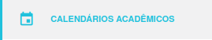
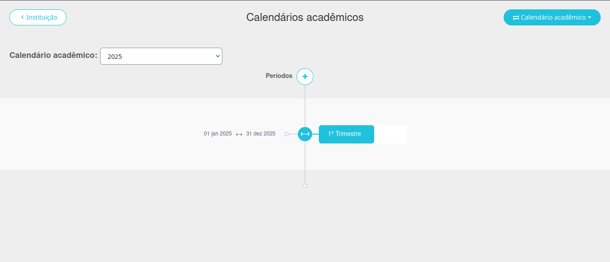
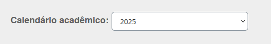
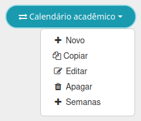
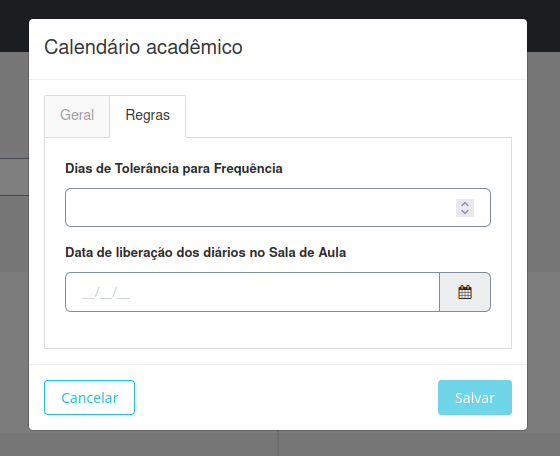

# Calendários Acadêmicos

Esta seção é destinada à configuração do calendário do ano e de cada período, como bimestres e trimestres. As principais funcionalidades incluem:

- **Criação do Calendário Acadêmico**: Crie calendários para os anos de 2024, 2025 e outros.
- **Configuração do Calendários Acadêmico**: Defina as regras.
- **Criação de Períodos**: Especifique os períodos do ano, como bimestres e trimestres.
- **Configuração do Período**: Defina as regras e as datas de início e fim de cada período.

Abaixo está um exemplo da interface para a configuração do calendário:

Você pode selecionar um calendário já criado utilizando o botão à esquerda:

A partir dessa interface, você poderá visualizar e realizar as seguintes operações:

- Selecionar um calendário existente.
- Editar, copiar ou excluir um calendário.

Nas seções seguintes, explicaremos detalhadamente como realizar cada uma das ações descritas acima.

## Criação do Calendário

No canto superior direito, localize o botão **Calendário Acadêmico** e clique nele:

Ao clicar, aparecerão as seguintes opções:

- **Novo**: Cria um novo calendário.
- **Copiar**: Duplica um calendário já existente.
- **Editar**: Permite alterar um calendário já criado.
- **Apagar**: Exclui um calendário existente.
- **Semanas**: Cria apenas semanas específicas, sem um ano completo (não aplicável ao Biângulo).

Selecione **Novo** ou **Copiar** para abrir a tela de criação/edição de calendário:

Campos a serem preenchidos:

- **Nome**: Nome do calendário.
- **Código**: Identificação única do calendário.
- **Data de início e Data de fim**: Período de duração do calendário.
- **Ano de referência**: Ano em que o calendário será vigente.

Certifique-se de que a opção **Ativo** esteja habilitada.

### Configuração do Calendário Acadêmico

Mude para a aba **Regras**, onde será possível:

- Definir a frequência mínima necessária.
- Estabelecer as datas para lançamento dos diários.

Após configurar, clique em **Salvar**.

## Criação de períodos:

### Configuração do período:
