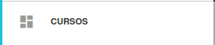
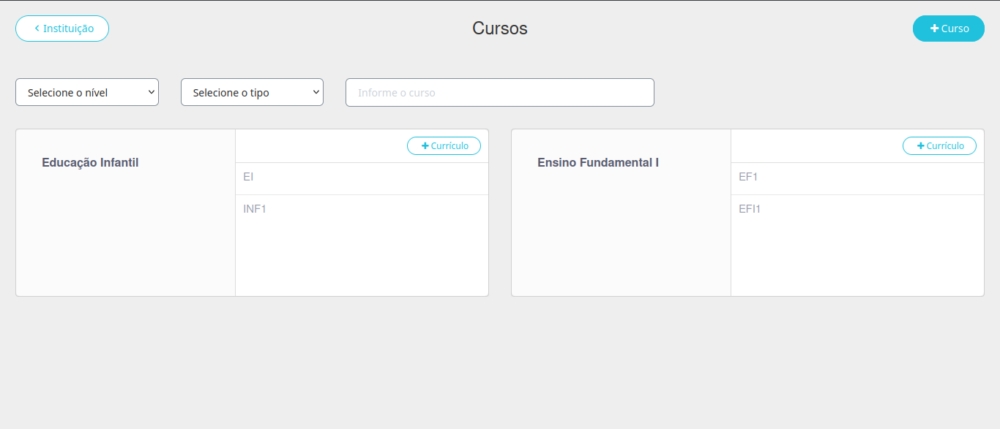
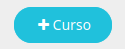
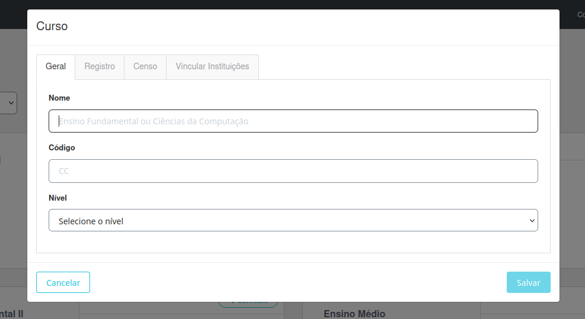
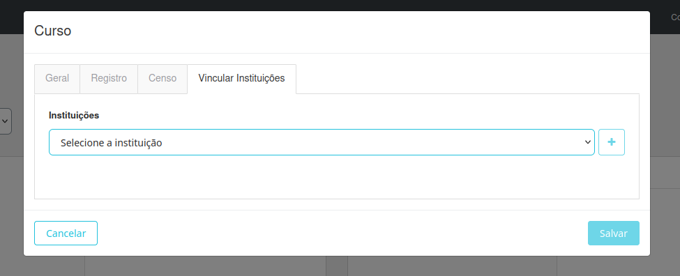
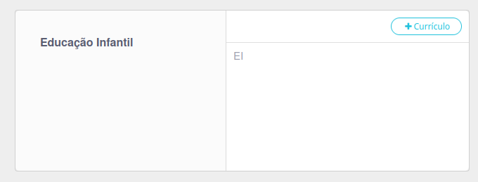
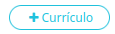
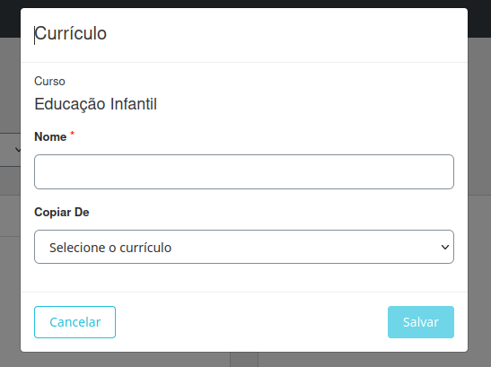
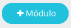
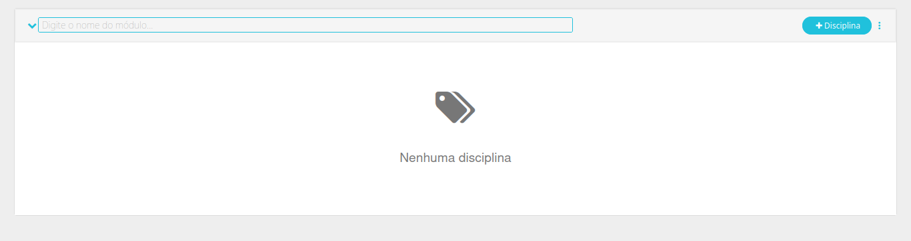

# Cursos

Esta seção é destinada à configuração e organização dos cursos da unidade escolar. As principais funcionalidades incluem:

- **Criação de Curso**: Configure os diferentes níveis de ensino oferecidos, como Educação Infantil, Ensino Fundamental, Ensino Médio, entre outros.
- **Definição do currículo**: Especifique as etapas de cada segmento, como por exemplo: 
    - *Educação Infantil*: Infantil e Bercário.
    - *Ensino Fundamental*: Ensino Fundamental 1 e Ensino Fundamental 2.
- **Configuração de módulos**: Especifica as etapas de um currículo, como por exemplo:
    - *Ensino Fundamental 1*: 2 ano, 3 ano, etc.
- **Configuração de disciplinas**: Defina o conjunto de disciplinas associadas a cada módulo, garantindo que estejam alinhadas com o currículo escolar.

Abaixo está um exemplo da interface para a configuração de cursos:

Abaixo explicaremos como fazer cada uma das ações descritas acima.

## Criação do Curso:

Para criar um curso, clique no ícone +Curso no canto superior direito da tela.

Um pop-up será exibido. Preencha a tela inicial com as seguintes informações:

- Nome do curso
- Código (abreviação)
- Nível de escolaridade

Em seguida, acesse a aba Vincular Instituições e selecione a unidade onde o curso estará disponível.

E assim seu curso estará criado e aparecerá na tela inicial.

## Criação do Currículo:

Para criar um currículo, é necessário ter concluído o passo anterior e criado um curso. Com o curso criado, um retângulo aparecerá na tela com o botão +Currículo. Clique nele.

Um pop-up será exibido. Preencha as informações solicitadas, como o nome do currículo. Caso já exista um currículo criado para este curso, será possível copiá-lo.

E assim seu currículo estará criado e aparecerá dentro do curso.

## Criação do Módulo:

Para criar um módulo, clique no currículo previamente criado dentro do curso.

Isso abrirá uma nova página. No canto superior direito, clique no botão +Módulo.

Você será direcionado para um campo onde poderá inserir o nome do módulo.

Após isso, você terá a opção de criar as disciplinas que farão parte do módulo.

### Criação das disciplinas :

Após criar o módulo aparecerá o botão +disciplina no conta do módulo

Após clicar abrirá uma nova página para preencher as informações da disciplina

Você de preencher

- Nome - nome da discplina 

- Área do conhecimento - Ciências ... Selecione uma opção criada ou crie uma [como criar área do conhecimento]()

- Agrupadora - Você pode juntar disciplinas de um mesmo módulo (Ex: Português - Gramática, literatura)

- 
