# Cursos

Esta seção é destinada à configuração e organização dos cursos da unidade escolar. As principais funcionalidades incluem:

- **Criação de Curso**: Configure os diferentes níveis de ensino oferecidos, como Educação Infantil, Ensino Fundamental, Ensino Médio, entre outros.
- **Definição do currículo**: Especifique as etapas de cada segmento, como por exemplo: 
    - *Educação Infantil*: Infantil e Bercário.
    - *Ensino Fundamental*: Ensino Fundamental 1 e Ensino Fundamental 2.
- **Configuração de módulos**: Especifica as etapas de um currículo, como por exemplo:
    - *Ensino Fundamental 1*: 2 ano, 3 ano, etc.
- **Configuração de disciplinas**: Defina o conjunto de disciplinas associadas a cada módulo, garantindo que estejam alinhadas com o currículo escolar.

Abaixo está um exemplo da interface para a configuração de cursos:

Abaixo explicaremos como fazer cada uma das ações descritas acima.

## Criação do Curso:

Para criar um curso, clique no ícone +Curso no canto superior direito da tela.

Um pop-up será exibido. Preencha a tela inicial com as seguintes informações:

- Nome do curso
- Código (abreviação)
- Nível de escolaridade

Em seguida, acesse a aba Vincular Instituições e selecione a unidade onde o curso estará disponível.

E assim seu curso estará criado e aparecerá na tela inicial.

## Criação do Currículo:

Para criar um currículo, é necessário ter concluído o passo anterior e criado um curso. Com o curso criado, um retângulo aparecerá na tela com o botão +Currículo. Clique nele.

Um pop-up será exibido. Preencha as informações solicitadas, como o nome do currículo. Caso já exista um currículo criado para este curso, será possível copiá-lo.

E assim seu currículo estará criado e aparecerá dentro do curso.

### Configuração do Currículo

Após criar o currículo, você pode clicá-lo para abrir uma nova página. Nessa página, haverá um botão de **Configuração**.

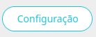

Ao clicar no botão, será aberta uma nova página onde, através das abas, é possível editar:

- **Geral**

    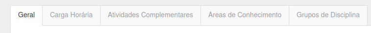

    - Nome do currículo: Nome definido inicialmente.
    - Quantidade mínima de matérias.
    - Quantidade máxima de matérias.
    - Prazo mínimo para integralização: (Não se aplica ao Biângulo).
    - Próximo curso ou currículo: Define o próximo curso que o aluno realizará ao concluir este currículo.

- **Carga Horária**

    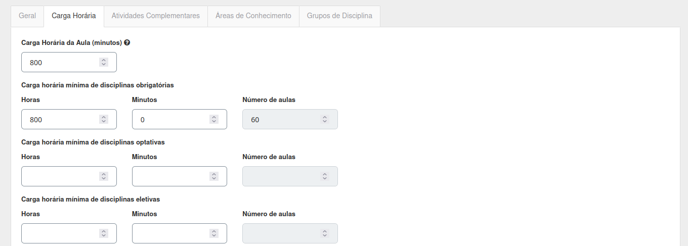

    - Preencha apenas a carga horária de aula de cada currículo.

- **Atividades Complementares**

   - (Não se aplica ao Biângulo).

- **Áreas de Conhecimento**

    - Categorias a que um conjunto de matérias pertence (ex.: Ciências - Biologia, Química e Física).

    - Clique no botão **+ Área de Conhecimento** e insira o nome desejado.

      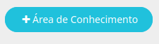

      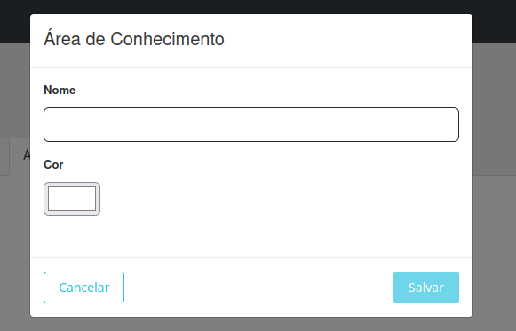

- **Grupo de Disciplina**

    - Define categorias da base curricular (ex.: MEC).

    - Clique no botão **+ Grupo de Disciplina** e insira o nome desejado.

      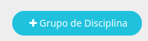

      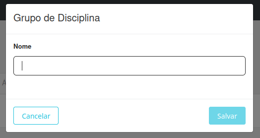

## Criação do Módulo:

Para criar um módulo, clique no currículo previamente criado dentro do curso.

Isso abrirá uma nova página. No canto superior direito, clique no botão +Módulo.

Você será direcionado para um campo onde poderá inserir o nome do módulo.

Após isso, você terá a opção de criar as disciplinas que farão parte do módulo.

### Criação das Disciplinas

Após criar o módulo, aparecerá o botão **+Disciplina** no canto do módulo.

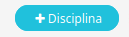

Ao clicar, abrirá uma nova página para preencher as informações da disciplina.

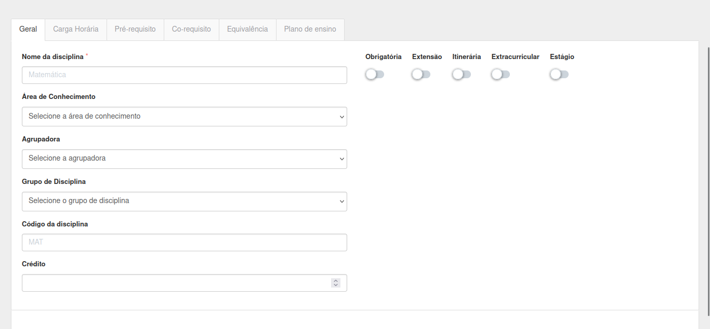

Você deve preencher:

- **Nome**: Nome da disciplina.
- **Área do conhecimento**: Escolha uma área existente (ex.: Ciências) ou crie uma nova. [Saiba como criar uma área do conhecimento](#configuracao-do-curriculo)
- **Agrupadora**: Permite juntar disciplinas de um mesmo módulo (ex.: Português - Gramática, Literatura).
- **Grupo de disciplina**: Escolha um grupo existente ou crie um novo. [Saiba como criar um grupo de disciplina](#configuracao-do-curriculo)
- **Código da disciplina**: Identificador da disciplina (ex.: Matemática - MAT).
- **Crédito**: No contexto do Biângulo, este campo não é utilizado.

Após preencher, marque as opções conforme o caso:

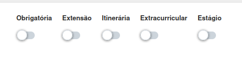

- **Obrigatória**: Disciplinas fundamentais definidas pelo MEC.
- **Extensão**: Disciplinas de horas complementares que não impedem a formação (não se aplica ao Biângulo).
- **Itinerário**: Matérias do contraturno previstas no novo padrão do MEC.
- **Extracurricular**: Matérias extras, como esportes.
- **Estágio**: Para casos em que o estágio é uma disciplina (não se aplica ao Biângulo).

Nas outras abas, você pode:

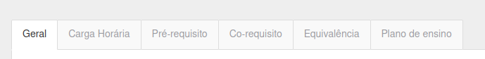

Configurar a **carga horária** da disciplina:

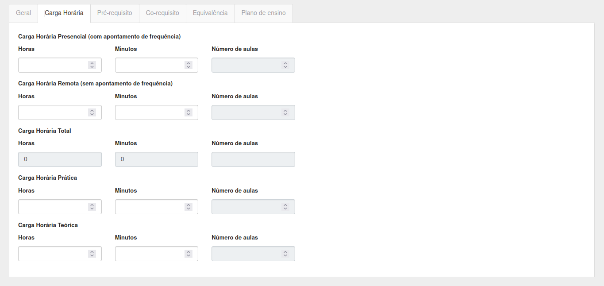

- Presencial (única utilizada no Biângulo)
- Remota
- Teórica
- Prática

**Pré-requisitos**: (Não se aplica ao Biângulo)

**Co-requisitos**: (Não se aplica ao Biângulo)

**Equivalência**: (Não se aplica ao Biângulo)

**Plano de ensino**: Seria a ementa da disciplina, mas não se aplica.
