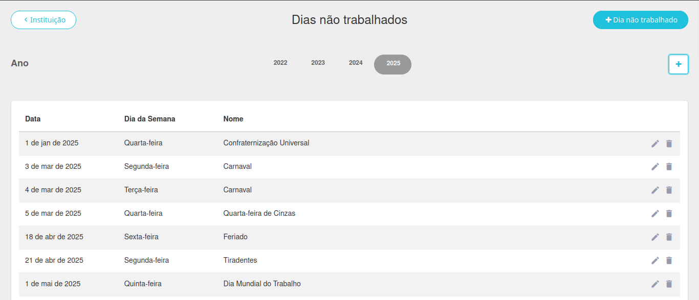
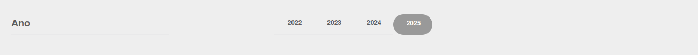
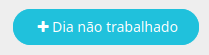
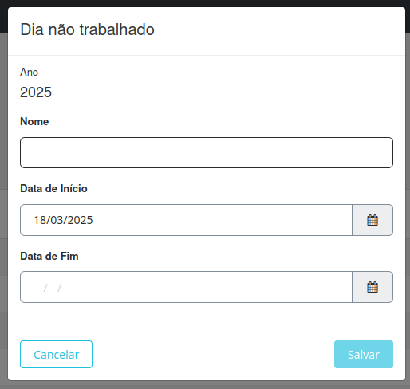
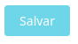
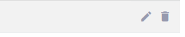

# Dias Não Trabalhados  

  

Esta seção permite a criação de feriados e dias sem aula que não estão no calendário nacional, como recessos escolares. As principais funcionalidades incluem:  

- **Criação de dias não trabalhados**: Configure os dias em que não haverá aulas.  
- **Adição de um novo ano**: Adicione um ano letivo para associar os dias não trabalhados.  

Abaixo está um exemplo da interface de dias não trabalhados:

  

A seguir, explicamos como realizar cada uma das ações mencionadas acima.  

## Criar um Dia Não Trabalhado  

Selecione ou [crie]() o ano desejado:  

     

Clique no botão **+ Dia não trabalhado** no canto superior direito da tela.  

     

Preencha as informações na tela que será exibida:  

     

   - **Nome**: Nome do dia sem aula (exemplo: Recesso de Carnaval).  
   - **Data de início**: Data em que o período sem aula começa.  
   - **Data de fim**: Data em que o período sem aula termina.  

Após preencher os campos, clique no botão **Salvar**.  

     

É possível editar o apagar um dia já criado clicando no lápis ou na lixeira, respectivamente.

## Adicionar um Novo Ano  

Clique no botão **+** no canto superior da tela.  

  

Na tela exibida, informe o ano desejado.  

Clique no botão **Salvar**.  

  

