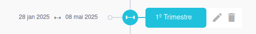

# Ofertas

Esta seção destina-se à configuração das ofertas da unidade para o ano letivo. As principais funcionalidades incluem:

## Funcionalidades

- **Criação dos segmentos a serem ofertados**: Defina os segmentos da unidade para o ano vigente.
- **Criação das turmas**: Configure as turmas de cada segmento, associando disciplinas e professores.
- **Publicação de notas e médias**: Torna as notas e médias visíveis na sala de aula.
- **Criação de aulas**: Aqui você cadastra a grade horária da turma.

Abaixo está um exemplo da interface da tela de ofertas:

A partir dessa interface, você poderá visualizar e realizar as seguintes operações:

- Selecionar o período letivo.
- Criar novos segmentos.
- Visualizar segmentos já criados.
- Gerenciar turmas, aulas e avaliações.

Nas seções seguintes, explicamos detalhadamente como executar cada uma dessas ações.

## Criação de Segmento

No canto superior, localize o botão **+** e clique nele:

Ao clicar, escolha as seguintes opções:

- **Curso**: Criado na seção 
- **Currículo**: Criado na seção 

## Criação de Turmas

Clique no segmento criado:

Ao clicar, aparecerão as seguintes opções:

- **Turmas**: Criar e editar turmas.
- **Aulas**: Criar e editar aulas.
- **Avaliações**: Criar e editar avaliações.

### Criando uma Turma

Selecione **Turmas**:

Clique no botão **+ Turmas**.

Uma nova tela será aberta. Preencha os seguintes campos:

- **Nome da turma**: Exemplo (A, B, C...).
- **Turno**: Período da turma (Matutino, Vespertino...).
- **Data de início e Data de fim**: Período de duração do calendário.
- **Código INEP**: Não se aplica.

Clique em **Salvar**.

## Configuração da Turma

Clique no nome da turma criada para acessar as opções:

- Editar os dados da turma.
- Adicionar disciplinas.
- Editar dados das disciplinas.

### Adicionando uma Disciplina

Após selecionar a turma, clique no botão **+ Disciplina**:

Uma nova tela será exibida:

Preencha os seguintes campos:

- **Disciplina**: Selecione uma disciplina correspondente ao segmento e currículo.
- **Nome complementar da disciplina**: Caso necessário, insira um nome alternativo.
- **Data de Início e Data de Fim de Indisponibilidade**: Intervalo em que a matéria ficará indisponível.
- **Desconsiderar Frequência no Sistema de Avaliação**.
- **Desconsiderar Média no Sistema de Avaliação**.
- **Semana do Calendário Acadêmico**.

Na parte superior, selecione **Professor** e escolha o professor responsável pela turma.

## Publicação de Notas e Médias

É possível realizar essa ação de forma geral para todas as turmas ou individualmente.

### Publicação Geral

Na tela de turmas, clique no botão **+ Ações**.

### Publicação Individual

Selecione a turma e repita o processo clicando em **+ Ações**.

As seguintes opções serão exibidas:

- **Publicar notas**: As notas aparecerão na sala de aula.
- **Despublicar notas**: Inverso do processo.
- **Publicar médias**: As médias do trimestre aparecerão na sala de aula.
- **Despublicar médias**: Inverso do processo.

## Criação de aulas

Selecione o segmento a clique na opção Aulas.  

Isso abrirá uma nova tela onde será possível:  

- Ver as aulas já criada basta selecionar a uma turma nos filtros.  

Para criar selecione um módulo e turma.

E clique no botão **+Quadro de horários**

Isso abrirá uma nova tela com a grade já criada, ou vazia.

Voocê pode selcionar uma dispilina no horário já existente ou clicar no lápis ao lado da turma e adicionar um horário.

Após configurar, lembre-se de clicar em **Salvar**.  

  

### Edição ou Remoção de Períodos  

Após a criação, você poderá editar ou remover um período. Para isso, passe o mouse sobre o período desejado. As seguintes opções aparecerão:  

- **Lápis**: Para editar o período.  
- **Lixeira**: Para remover o período.  

  

