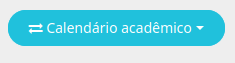
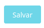

# Ofertas

Esta seção destina-se à configuração das ofertas da unidade para o ano letivo. As principais funcionalidades incluem:

## Funcionalidades

- **Criação dos segmentos a serem ofertados**: Defina os segmentos da unidade para o ano vigente.
- **Criação das turmas**: Configure as turmas de cada segmento, associando disciplinas e professores.
- **Publicação de notas e médias**: Torne as notas e médias visíveis na sala de aula.
- **Criação de aulas**: Cadastre a grade horária da turma.

Abaixo está um exemplo da interface da tela de ofertas:

A partir dessa interface, você poderá visualizar e realizar as seguintes operações:

- Selecionar o período letivo.
- Criar novos segmentos.
- Visualizar segmentos já criados.
- Gerenciar turmas, aulas e avaliações.

Nas seções seguintes, explicamos detalhadamente como executar cada uma dessas ações.

## Criação de Segmento

No canto superior, localize o botão **+** e clique nele:

Ao clicar, escolha as seguintes opções:

- **Curso**: Criado na seção [Curso](link_placeholder).
- **Currículo**: Criado na seção [Currículo](link_placeholder).

## Criação de Turmas

Clique no segmento criado:

Ao clicar, aparecerão as seguintes opções:

- **Turmas**: Criar e editar turmas.
- **Aulas**: Criar e editar aulas.
- **Avaliações**: Criar e editar avaliações.

### Criando uma Turma

Selecione **Turmas**:

Clique no botão **+ Turmas**.

Uma nova tela será aberta. Preencha os seguintes campos:

- **Nome da turma**: Exemplo (A, B, C...).
- **Turno**: Período da turma (Matutino, Vespertino...).
- **Data de início e Data de fim**: Período de duração do calendário.
- **Código INEP**: Não se aplica.

Clique em **Salvar**.

## Configuração da Turma

Clique no nome da turma criada para acessar as opções:

- Editar os dados da turma.
- Adicionar disciplinas.
- Editar dados das disciplinas.

### Adicionando uma Disciplina

Após selecionar a turma, clique no botão **+ Disciplina**:

Uma nova tela será exibida:

Preencha os seguintes campos:

- **Disciplina**: Selecione uma disciplina correspondente ao segmento e currículo.
- **Nome complementar da disciplina**: Caso necessário, insira um nome alternativo.
- **Data de Início e Data de Fim de Indisponibilidade**: Intervalo em que a matéria ficará indisponível.
- **Desconsiderar Frequência no Sistema de Avaliação**.
- **Desconsiderar Média no Sistema de Avaliação**.
- **Semana do Calendário Acadêmico**.

Na parte superior, selecione **Professor** e escolha o professor responsável pela turma.

## Publicação de Notas e Médias

É possível realizar essa ação de forma geral para todas as turmas ou individualmente.

### Publicação Geral

Na tela de turmas, clique no botão **+ Ações**.

### Publicação Individual

Selecione a turma e repita o processo clicando em **+ Ações**.

As seguintes opções serão exibidas:

- **Publicar notas**: As notas aparecerão na sala de aula.
- **Despublicar notas**: Inverso do processo.
- **Publicar médias**: As médias do trimestre aparecerão na sala de aula.
- **Despublicar médias**: Inverso do processo.

## Criação de Aulas

Selecione o segmento e clique na opção **Aulas**.

Isso abrirá uma nova tela onde será possível:

- Ver as aulas já criadas ao selecionar uma turma nos filtros.

Para criar, selecione um módulo e turma.

E clique no botão **+ Quadro de horários**.

Isso abrirá uma nova tela com a grade já criada, ou vazia.

Você pode selecionar uma disciplina no horário já existente ou clicar no lápis ao lado da turma e adicionar um horário.

Após configurar, lembre-se de clicar em **Salvar**.

Após concluir, clique em **Gerar Aulas** para gerar todas as aulas da turma.

Caso necessário, é possível apagar todas as aulas com o botão **Apagar aulas**.

## Criação de Avaliações

Após a criação do segmento e das turmas, você poderá criar as avaliações para informar suas respectivas notas e pesos. Selecione o segmento e clique em **Avaliações**.

Selecione no topo a série.

Após isso, selecione uma turma.

Selecione a matéria; abrirão os períodos.

Clique no **+** no respectivo período.

Abrirá uma nova tela com os seguintes campos para preenchimento:

- **Nome**:
- **Código**:
- **Nota máxima**:
- **Peso**:
- **Ignorar fórmula**:

Preencha os campos e clique em **Salvar**.

No topo, selecione **Copiar em** para replicar esta avaliação em outras matérias e períodos.

E clique em **Salvar**.

Após criar, ao passar o mouse por cima, você pode apagar ou editar a avaliação.

## Ajuste de Fórmulas

Após clicar em uma matéria, você pode ajustar a fórmula daquele período (para calcular a avaliação do aluno) no ícone:

Selecione a opção mais adequada.

Você pode testar a conta clicando no ícone:

## Outras Funcionalidades

Para facilitar o uso do sistema, o Gennera disponibiliza as seguintes opções no botão de **Ações**:

- **Fórmulas**: Para personalizar uma fórmula.
- **Fórmula de média do período**: Para alterar a fórmula.
- **Modelos de avaliações**: Aqui você pode criar um avaliação para vários segmentos de uma única vez.
- **Processar médias de períodos**: Pode verificar se os pesos estão calculados correntamente.
- **Acompanhamento de cálculo médio**: Visualizar quem rodou as médias.

