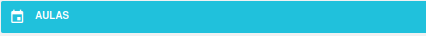

# Ofertas

Esta seção destina-se à configuração das ofertas da unidade para o ano letivo, será o espelho do que os alunos observam no [Sala de aula](). As principais funcionalidades incluem:

## Funcionalidades

- **Criação dos segmentos a serem ofertados**: Defina os segmentos da unidade para o ano vigente.
- **Criação das turmas**: Configure as turmas de cada segmento, associando disciplinas e professores.
- **Publicação de notas e médias**: Torne as notas e médias visíveis na sala de aula.
- **Criação de aulas**: Cadastre a grade horária da turma.

Abaixo está um exemplo da interface da tela de ofertas:

A partir dessa interface, você poderá visualizar e realizar as seguintes operações:

- Selecionar o período letivo.
- Criar novos segmentos.
- Visualizar segmentos já criados.
- Gerenciar turmas, aulas e avaliações.

Nas seções seguintes, explicamos detalhadamente como executar cada uma dessas ações.

## Criação de Segmento

No canto superior, localize o botão **+** e clique nele:

Ao clicar, escolha as seguintes opções:

- **Curso**: Criado na seção [Curso](./curso.md).
- **Currículo**: Criado na seção [Currículo](./curso.md).

## Criação de Turmas

Clique no segmento criado:

Ao clicar, aparecerão as seguintes opções:

- **Turmas**: Criar e editar turmas.
- **Aulas**: Criar e editar aulas.
- **Avaliações**: Criar e editar avaliações.

### Criando uma Turma

Selecione **Turmas**:

Abrirá uma nova tela:

Clique no botão **+ Turmas**.

Uma nova tela será aberta. Preencha os seguintes campos:

- **Nome da turma**: Exemplo (A, B, C...).
- **Turno**: Período da turma (Matutino, Vespertino...).
- **Data de início e Data de fim**: Período de duração do calendário.
- **Código INEP**: Não se aplica.

Clique em **Salvar**.

## Configuração da Turma

Clique no nome da turma criada para acessar as opções:

- Editar os dados da turma.
- Adicionar disciplinas.
- Editar dados das disciplinas.

### Adicionando uma Disciplina

Após selecionar a turma, clique no botão **+ Disciplina**:

Uma nova tela será exibida:

Preencha os seguintes campos:

- **Disciplina**: Selecione uma disciplina correspondente ao segmento e currículo.
- **Nome complementar da disciplina**: Caso necessário, insira um nome alternativo.
- **Data de Início e Data de Fim de Indisponibilidade**: Intervalo em que a matéria ficará indisponível.
- **Desconsiderar Frequência no Sistema de Avaliação**.
- **Desconsiderar Média no Sistema de Avaliação**.
- **Semana do Calendário Acadêmico**.

Na parte superior, selecione **Professor** e escolha o professor responsável pela turma.

clique em **Salvar**:

## Publicação de Notas e Médias

É possível realizar essa ação de forma geral para todas as turmas ou individualmente.

### Publicação Geral

Na tela de turmas, clique no botão **+ Ações**.

### Publicação Individual

Selecione a turma e repita o processo clicando em **+ Ações**.

As seguintes opções serão exibidas:

- **Publicar notas**: As notas aparecerão na sala de aula.
- **Despublicar notas**: Inverso do processo.
- **Publicar médias**: As médias do trimestre aparecerão na sala de aula.
- **Despublicar médias**: Inverso do processo.

## Criação de Aulas

Selecione o segmento e clique na opção **Aulas**.

Isso abrirá uma nova tela onde será possível:

- Ver as aulas já criadas ao selecionar uma turma nos filtros.

Para criar, selecione um módulo e turma.

E clique no botão **+ Quadro de horários**.

Isso abrirá uma nova tela com a grade já criada onde você pode escolher as disciplinas da turma, ou vazia.

  
Como criar uma nova grade

  
Você pode selecionar uma disciplina no horário já existente ou clicar no lápis ao lado da turma e adicionar um horário.

  

  
Isso vai abrir uma tela para selecionar o período do novo horário:

  

  
Clique no mais:

  

  
Onde você pode explicar o horário e se é um intervalo:

  

  
Após configurar, lembre-se de clicar em <b>Salvar</b>.

  

Após concluir, clique em **Gerar Aulas** para gerar todas as aulas da turma.

Caso necessário, é possível apagar todas as aulas com o botão **Apagar aulas**, na tela anterior a esta.

## Criação de Avaliações

Após a criação do segmento e das turmas, você poderá criar as avaliações para informar suas respectivas notas e pesos. Selecione o segmento e clique em **Avaliações**.

Isso irá abrir a seguinte tela:

Selecione no topo a série.

Após isso, selecione uma turma.

Selecione a matéria; abrirão os períodos.

Clique no **+** no respectivo período.

Abrirá uma nova tela com os seguintes campos para preenchimento:

- **Nome**: Da avaliação
- **Código**: Abreviação da avaliação
- **Nota máxima**: maior nota
- **Peso**: Peso que ela vale na média do périodo
- **Ignorar fórmula**: para não contabilizar a avaliação na média

Preencha os campos e clique em **Salvar**.

No topo, selecione **Copiar em** para replicar esta avaliação em outras matérias e períodos.

E clique em **Salvar**.

Após criar, ao passar o mouse por cima, você pode apagar ou editar a avaliação.

### Ajuste de Fórmulas

Após clicar em uma matéria, você pode ajustar a fórmula daquele período (para calcular a avaliação do aluno) no ícone **X²**:

Selecione a opção mais adequada.

Você pode testar a fórmula clicando no ícone **▶**:

### Outras Funcionalidades:

Para facilitar o uso do sistema, o Gennera disponibiliza as seguintes opções no botão de **Ações**:

- **Fórmulas**: Para personalizar uma fórmula.
- **Fórmula de média do período**: Para alterar a fórmula.
- **Modelos de avaliações**: Aqui você pode criar um avaliação para vários segmentos de uma única vez.
- **Processar médias de períodos**: Pode verificar se os pesos estão calculados correntamente.
- **Acompanhamento de cálculo médio**: Visualizar quem rodou as médias.

