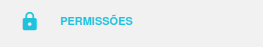
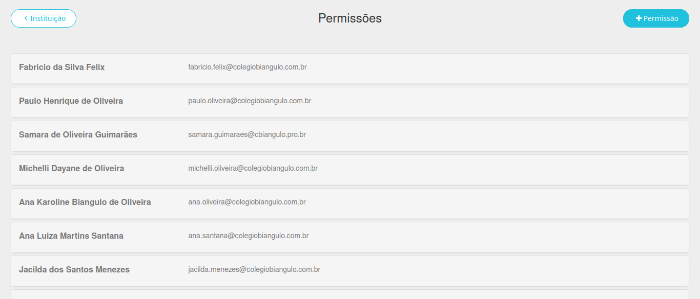
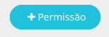
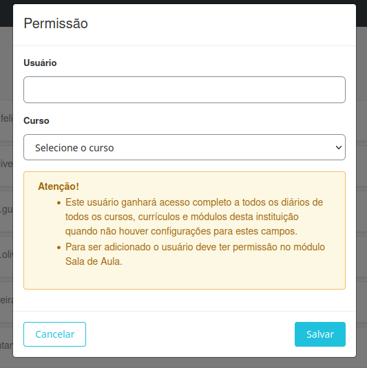

# Permissões  

  

Esta seção permite conceder acesso aos diários para pessoas que não sejam professores ou alunos. As principais funcionalidades incluem:  

- **Liberação de usuários**: Visualizar e conceder permissão a usuários para acessar os diários.  

Abaixo está um exemplo da interface:  

  

A seguir, explicamos como realizar cada uma das ações mencionadas.  

## Liberação de usuários  

Para conceder permissão a um usuário, clique no botão **+Permissão** no canto superior direito da tela.  

  

Uma nova tela será exibida. Preencha os seguintes campos:  

  

- **Usuário**: Informe o e-mail ou nome completo da pessoa.  
- **Curso**: Selecione o segmento ao qual o usuário terá acesso. Caso deixe em branco, ele poderá visualizar todos.  

Após preencher as informações, clique em **Salvar**.  

  

