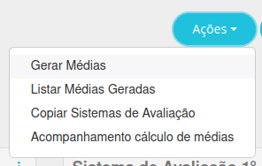

# Sistemas de Avaliação

Esta seção permite gerar e publicar as médias finais, além de ajustá-las após recuperações. As principais funcionalidades incluem:

- **Criação de sistemas de avaliação**: Configure diferentes fórmulas para calcular e ajustar notas ao final de cada período ou calendário.
- **Geração das médias**: Execute as fórmulas para calcular e disponibilizar publicamente as médias dos alunos.

Abaixo está um exemplo da interface desta seção:

A seguir, explicamos como realizar cada uma das ações mencionadas acima.

## Geração das Médias

Clique no botão superior **Ações**:

Selecione a opção **Gerar médias**. Isso abrirá uma nova tela onde você poderá escolher até qual nível deseja gerar a média:

- **Oferta de currículo**: Gera as médias para todo o segmento, por exemplo, todo o ensino médio.  
- **Módulo**: Gera as médias de um segmento específico do currículo, como a terceira série do ensino médio.  
- **Turma**: Gera as médias de uma turma específica dentro do segmento, como a turma A da terceira série.  
- **Disciplina**: Gera a média de uma matéria específica dentro da turma.  
- **Aluno**: Gera a média de um aluno específico.  

obs: Ao marcar a primeira opção, já é possível gerar as médias.  
Após isso, clique em **Gerar**.

  
Outras funções do botão "Opções"

  
Ao clicar no botão <b>Opções</b>, além de gerar as médias, você pode:

  <ul>
    <li>Listar médias geradas: para ver as médias que forma geradas de cada aluno</li>
    <li>Copiar Sistemas de Avaliação: copiar as fórmulas de um modelo já criado</li>
    <li>Acompanhemento cálculo de médias: acompanhar quem gerou as médias</li>
  </ul>

## Criação de sistemas de avaliação
obs: esta secção aplicasse apenas para a T.I

Clique no botão **+Sistema de Avaliação**:

Isso irá abir uma nova tela, onde deve ser preenchido:

- **Nome**: Nome do sistema de avaliação.  
- **Código**: Identificação única para o sistema de avaliação.  
- **Oferta de Currículo**: Determina o currículo ao qual o sistema de avaliação será aplicado.  
- **Módulo**: Determina um segmento específico.
- **Média Final**: Define a fórmula ou critérios para calcular a média final do aluno.  
- **Nota Mínima**: Nota mínima exigida para aprovação em uma disciplina.  
- **Frequência Mínima (%)**: Percentual mínimo de presença necessário para aprovação.  
- **Número de Disciplinas para Reprovação Geral**: Quantidade máxima de disciplinas em que um aluno pode ser reprovado antes de ser considerado reprovado no curso inteiro.  
- **Data para Geração do Resultado (Status)**: Data programada para o sistema gerar os resultados finais dos alunos.

Você também pode ajustar as regras clicando na parte supeiror em **Regras**,
Onde pode escolher:

- **Considerar como presença as frequência(s) não aplicada(s)**: calcula usando dias em que o professor não lançou a presença.
- **Considerar frequência mínima (%) para reprovação geral** usa a frequência para reprovar o aluno direto.
- **Gerar % frequência parcial**: Ao final de cada périodo o percentual de frequência já é calculado.

### Criação de média:

Após criar um sistema você pode criar fórmulas específicas, clicando em **+médias**:

Isso abrirá uma nova tela, onde você deve preencher:

- **Nome**: Nome do sistema ou critério de avaliação.  
- **Código**: Identificação única para o sistema ou fórmula de avaliação.  
- **Carregar Detalhes de Disciplinas Filhas**: Indica se os detalhes das disciplinas filhas devem ser considerados no cálculo da média.  
- **Fórmula**: Define a fórmula utilizada para calcular as médias finais, levando em conta diferentes períodos e recuperações.

Também é possível simular a formula nos campos que seguem.

É possível editar ou excluir uma média já criada clicando no lápis ou na lixeira.

