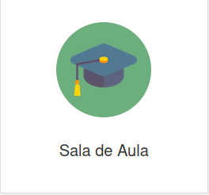
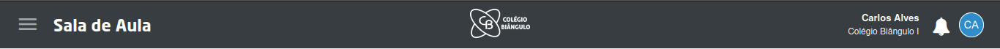
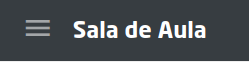
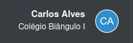
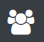
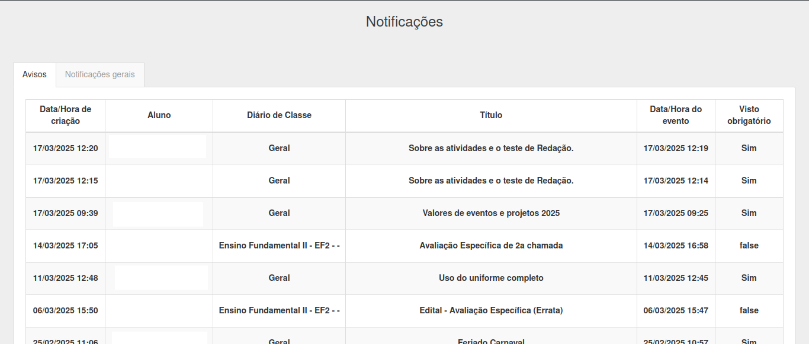
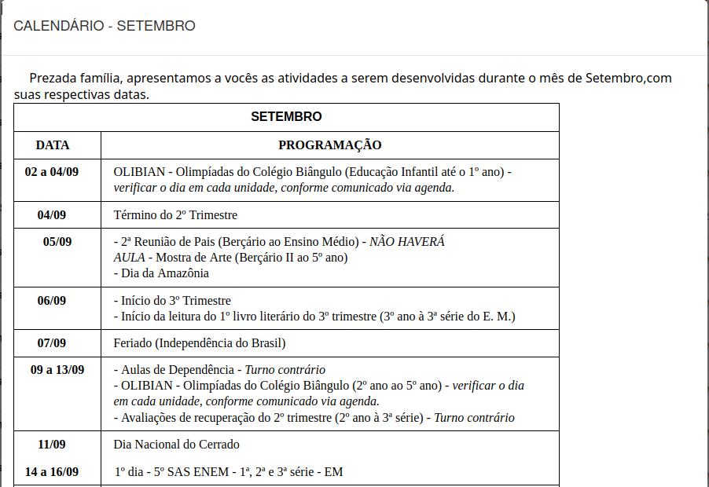
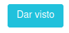
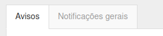
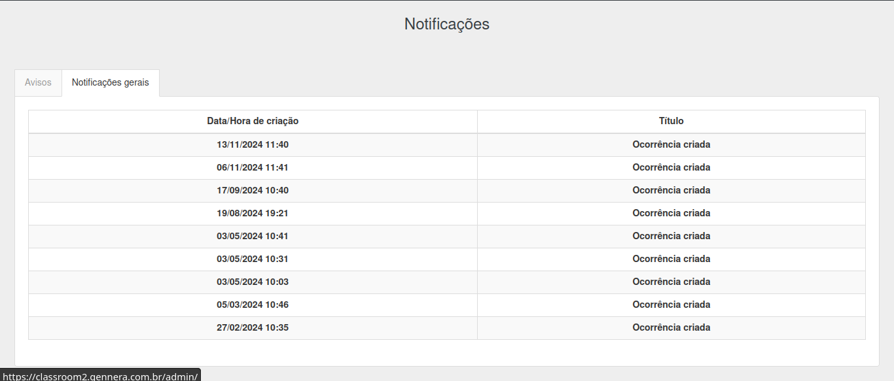

# Sala de Aula  

Esta seção apresenta o módulo **Sala de Aula**, detalhando suas partes e funcionalidades.  

  

Este arquivo oferece uma visão geral da tela inicial do módulo, enquanto os demais arquivos desta pasta explicam cada funcionalidade em detalhes.  

## Barra Superior  

  

Na barra superior, você encontrará:  

- **Ícone de sanduíche**: Exibe as funcionalidades do módulo, detalhadas nos outros arquivos desta pasta.  

    

  - **Funcionalidades disponíveis**:  

      1. [Diários de classe]()  
      2. [Número de diário]()  
      3. [Calendário]()  
      4. [Grupos de discussão]()  
      5. [Ocorrências]()  
      6. [Protocolos]()  
      7. [Biblioteca]()  
      8. [Avisos institucionais]()  
      9. [Matrículas]()  
      10. [Financeiro]()  

- **Ícone do perfil**: Permite alternar entre as unidades às quais você tem acesso.  

    

- **Ícone de usuários associados**: Se você tiver perfis associados ao seu, é possível alternar entre eles clicando neste ícone.  

    

## Tela Inicial  

### Pais e Alunos  

Ao acessar o módulo **Sala de Aula**, caso tenha outro usuário associado, será necessário escolher com qual deseja entrar. Em seguida, você será direcionado para a tela de **Notificações**.  

  

Nesta tela, você pode visualizar todos os avisos enviados pelo colégio. Basta clicar em um deles para ler o conteúdo.  

  

Após ler o aviso, caso necessário, clique no botão **Dar visto** para marcá-lo como lido.  

  

Na parte superior da tela, você pode alternar para visualizar as **notificações gerais**.  

  

  

### Professores e Funcionários  

Ao acessar o módulo **Sala de Aula**, você será direcionado diretamente para os [Diários de Classe]().  

